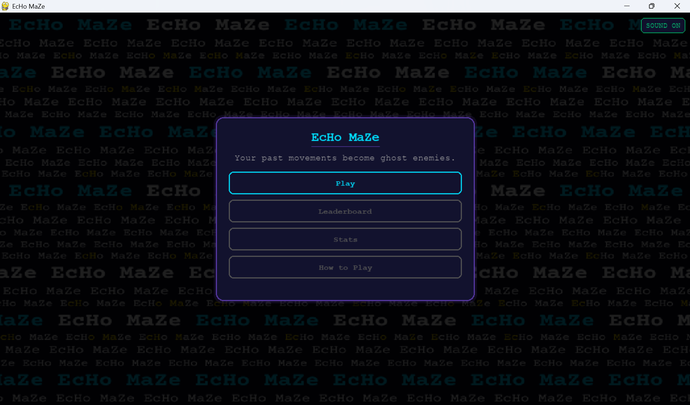
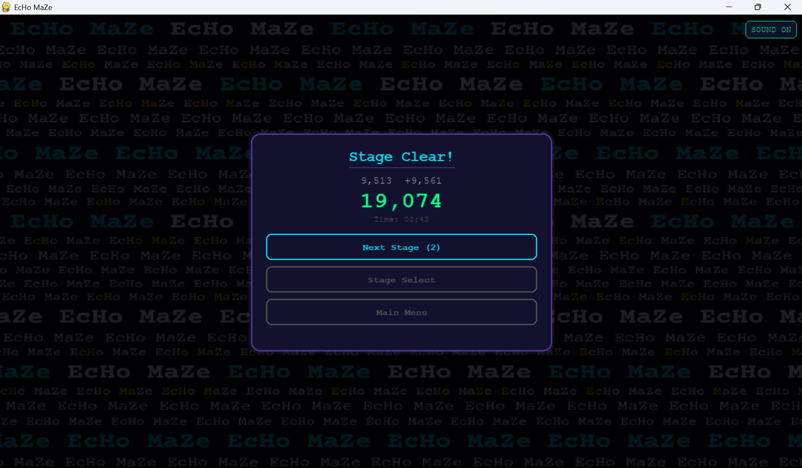
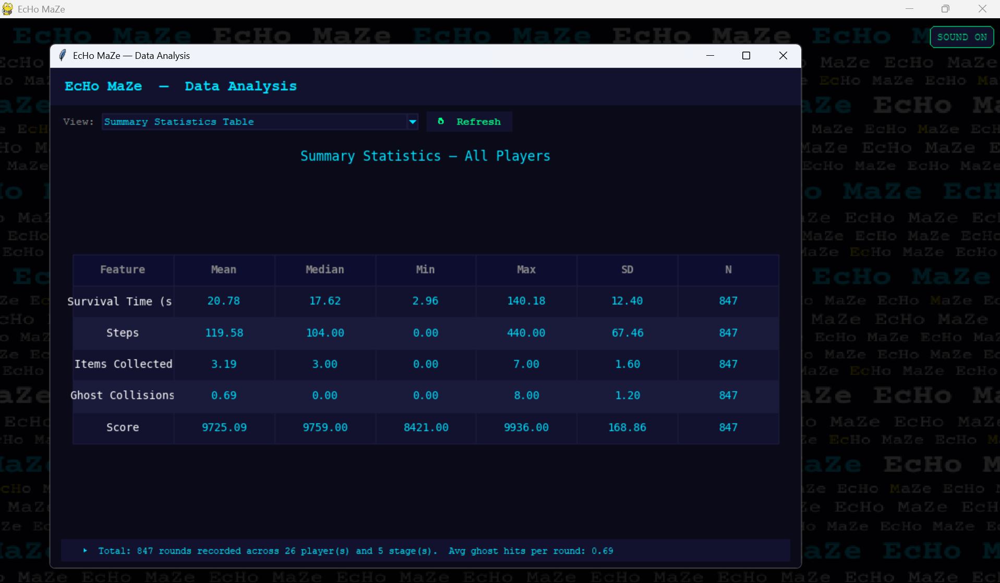
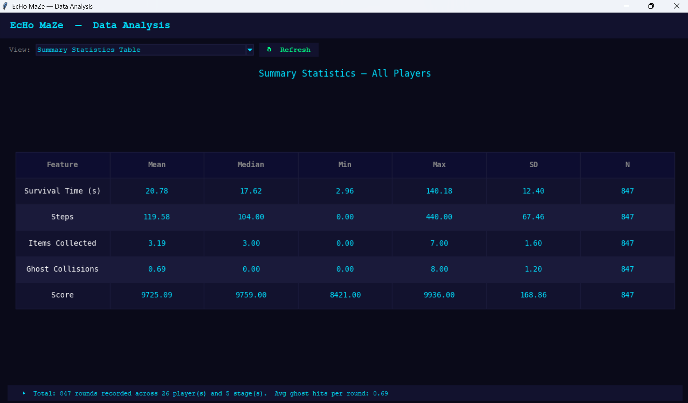

# Project Description

## 1. Project Overview

- **Project Name:** EcHo MaZe
- **Project by:** Panyasiri Aimngern

**Brief Description:**

EcHo MaZe is a grid-based maze game built with Python and Pygame. The player navigates through a maze, collects checkpoints, and reaches the goal to complete each round. What makes this game different is the Echo System — every move the player makes in one round gets recorded and replayed as a ghost enemy in the next round. In Round 2, the player has to avoid their own past movements, and in Round 3, they face two ghosts simultaneously.

The game has 5 stages, each with 3 rounds of increasing difficulty. Stages get progressively harder as maze layouts become more complex, paths get tighter, and ghost patterns become harder to avoid. All gameplay data is recorded automatically every round and can be explored through a separate interactive Data Analysis window with real-time charts and statistics.

- **Problem Statement:**

Most maze games become repetitive quickly because the only challenge is finding the right path. Once a player knows the layout, the difficulty drops significantly. EcHo MaZe addresses this by making the player's own past decisions the main obstacle. A poorly planned route in Round 1 creates a harder ghost path to avoid in Round 2 and Round 3. This means the game stays challenging even after the player already knows the maze layout, because the real challenge is avoiding themselves.

- **Target Users:**

Casual gamers who enjoy puzzle and strategy games, and anyone who wants a maze game with more depth than just finding the exit. Also suitable for players who enjoy competing for high scores with friends through the leaderboard system.

- **Key Features:**
  - **Echo System** — movement from each round replays as a ghost enemy in the next round
  - **5 Stages, 3 Rounds each** — stages unlock progressively as the player clears them; clearing all 3 rounds of a stage unlocks the next
  - **Stage Unlock System** — unlock progress is saved to a file per player name, so progress persists between sessions
  - **Breakable Walls** — orange walls can be broken with Space + direction (3 hits), opening new shortcuts through the maze
  - **Grace Period** — a 3-second countdown at the start of rounds with ghosts, during which ghosts are frozen so the player can reposition
  - **Retry / Restart System** — after a round ends, the player can Restart Round (keeps ghost recordings) or Retry Stage (erases all recordings and starts from Round 1)
  - **Score System** — score is calculated as `10,000 − (time × 10)`, rewarding faster stage completion
  - **Leaderboard** — top 5 players by total score and top 5 by fewest total ghost hits
  - **Data Analysis Report** — 6 real-time visualizations in a separate interactive Tkinter window with a Refresh button and dynamic insight bar
  - **Player Stats** — search by player name to view personal performance history, stage clear rates, and overview statistics
  - **How to Play** — interactive 7-page tutorial built into the game with rendered Pygame sprites as illustrations
  - **Sound System** — background music and sound effects for checkpoints, goals, stage clears, game over, wall breaking, and grace period; can be toggled on/off with the Sound button in the top-right corner of every non-gameplay screen
  - **Resizable Window** — the game window can be resized at any time and the maze, HUD, and mission bar all scale proportionally

- **Screenshots:**

**Gameplay**

*Main menu — entry point of the game with options to Play, view Leaderboard, Stats, and How to Play*

.png)
*Round 1 — no ghosts present, player explores the maze freely and movement is recorded*

.png)
*Round 3 — two ghosts replay the player's paths from Round 1 and Round 2 simultaneously*

*Stage Clear screen — shows total score and time after completing all 3 rounds*

**Data Visualization**

*Data Analysis window — interactive Tkinter window with dropdown to switch between 6 visualization views and a dynamic insight bar at the bottom*

*Summary Statistics Table — shows Mean, Median, Min, Max, SD, and N for all 5 gameplay features across all players and sessions*

- **Proposal:** [proposal.pdf](proposal.pdf)

- **YouTube Presentation:** https://youtu.be/erHQHeqj8TU?si=cmrLvthFDw87YRT8

---

## 2. Concept

### 2.1 Background

The idea came from thinking about what actually makes a maze game challenging in the long run. Standard maze games give the player a fixed set of enemies with predictable AI, so once the player learns the patterns, the game loses its difficulty. EcHo MaZe takes a completely different approach — the enemies are the player's own past movements. The ghost follows the exact path taken in the previous round, so inefficient routing and unnecessary detours literally come back to haunt the player in future rounds.

This creates a problem worth solving: most maze games stop being interesting after the layout is memorized, but EcHo MaZe forces the player to think strategically from the very first move, because every step in Round 1 directly determines how hard the ghost will be to avoid in Rounds 2 and 3. The challenge does not come from the maze itself — it comes from the player's own decision-making.

The name "Echo" reflects this mechanic — actions echo back in later rounds.

A reference game for this project is Pac-Man (Namco, 1980), which is also a maze-based game where the player collects items while avoiding enemies. EcHo MaZe extends this concept with several key differences:

- **Enemy behavior** — Pac-Man ghosts chase the player using AI pathfinding. In EcHo MaZe, ghosts replay the player's own recorded movements from previous rounds, making the obstacle entirely player-generated rather than AI-driven.
- **Game progression** — Pac-Man uses continuous levels with the same maze layout. EcHo MaZe uses 5 distinct stages with 3 rounds each, where difficulty increases through both maze complexity and ghost density.
- **Strategy focus** — Pac-Man rewards reactive dodging and pattern memorization. EcHo MaZe rewards proactive route planning, since an inefficient path in Round 1 directly creates a harder obstacle in Rounds 2 and 3.

### 2.2 Objectives

- Design and implement a maze game with a unique self-referential mechanic where the player's own movement becomes the enemy
- Build a complete 5-stage progression system where each stage has 3 rounds with increasing ghost difficulty
- Implement OOP design where each class has a clearly defined responsibility — GameManager for game flow, Player for movement and recording, Ghost for replay, Map for the environment, and Mission for objectives
- Record gameplay statistics automatically every round and store them in a structured CSV format for analysis
- Present collected data through meaningful visualizations that help players understand their own performance patterns
- Give players tools to compare their performance with others through a leaderboard and to track personal improvement through individual player stats

---

## 3. UML Class Diagram

The UML class diagram shows all classes, their attributes, methods, and relationships including composition, association, and dependency.

- [echo_maze_uml.pdf](echo_maze_uml.pdf)

**Relationships summary:**
- `GameManager` has **composition** with `Player`, `Map`, `Mission`, `Ghost` (0..*), and `Panel` — these objects are created and owned by GameManager and do not exist independently
- `GameManager` has **association** with `Button` and `TextInput` — used for UI rendering but not exclusively owned
- `Ghost` has **association** with `Player` — reads the recorded path to replay movement
- `Mission` has **association** with `Map` — reads checkpoint positions to track collection
- `GameManager` has **dependency** on `stats`, `data_window`, `tutorial`, and `visualization` modules — calls their functions but does not own them

---

## 4. Object-Oriented Programming Implementation

- **GameManager** (`game_manager.py`) — the central controller of the entire game. Manages screen states (`menu`, `playing`, `paused`, `gameover`, etc.), stage and round progression, ghost creation from recorded paths, sound playback, and all UI rendering. Uses composition to own Player, Map, Mission, Ghost, and Panel, and delegates responsibilities to each class instead of handling everything itself. Has a class variable `GRACE_TOTAL = 3.0` that defines the grace period duration in seconds.

- **Player** (`player.py`) — represents the player character. Handles grid-based movement with collision checking against the maze, smooth pixel interpolation between tiles for visual smoothness, wall breaking via `try_break()`, and step counting. Records every position change into a `path` list which is later used to create Ghost objects. Encapsulates all player state so that GameManager only needs to call `try_move()`, `try_break()`, and `update()`.

- **Ghost** (`ghost.py`) — replays a recorded path from a previous round. Takes a path list as input and moves through it step by step, with smooth pixel interpolation matching the Player's movement style. Handles collision detection with the player by comparing grid positions. Makes the Echo System work by treating recorded data as a movement script.

- **Map** (`map.py`) — stores and manages the maze grid for each stage. Parses the raw string layout from `constants.py`, identifies walls, floors, checkpoints, goal, and breakable walls, and tracks breakable wall HP using a `breakable_hp` dictionary that maps grid positions to remaining hit points (1–3). Provides `is_wall()` and `is_breakable()` for movement and break-action validation, and handles rendering at both fixed and scaled tile sizes for responsive display.

- **Mission** (`mission.py`) — tracks checkpoint collection status using a set to avoid duplicate collection. Uses Python `@property` decorators for `is_complete` and `count` to expose computed state without storing redundant data, which is an example of clean encapsulation. GameManager queries these properties to decide when to open the goal.

- **Panel** (`ui.py`) — a reusable overlay system that renders centered UI panels from a list of item descriptors (title, body, input, buttons, extra). Separates layout calculation from drawing so that positions are computed before rendering. Used across all non-gameplay screens.

- **Button** (`ui.py`) — a clickable UI element with hover detection, click detection via event checking, and three visual styles (primary, secondary, danger). Encapsulates all button rendering and interaction logic so GameManager only needs to check `is_clicked()`.

- **TextInput** (`ui.py`) — a text input field with active/inactive state, backspace handling, cursor blinking, and a max length limit. Supports Thai font rendering for player name input. Returns `True` from `handle_event()` when the user presses Enter, signaling GameManager to proceed.

- **tutorial.py** — a module (not a class) that builds and runs the How to Play window using Tkinter. Renders game sprites (player, ghost, checkpoint, goal, breakable wall) using Pygame surfaces converted to Tkinter-compatible images, then displays them across 7 interactive pages with navigation buttons.

- **visualization.py** — a module (not a class) that generates a static multi-panel data analysis report using Matplotlib. Exports the chart as a PNG and opens it with the system's default image viewer. Used as an alternative to the interactive data window for a quick all-in-one overview.

---

## 5. Statistical Data

### 5.1 Data Recording Method

Gameplay data is saved automatically at the end of every round using Python's built-in `csv` module. The `save_record()` function in `stats.py` appends a new row to `data/game_data.csv` each time a round ends — whether the player completed it or was caught by a ghost. The CSV file is created automatically with the correct headers if it does not exist yet. Data is read back using `get_records()`, which parses and type-converts each field (integers, floats, and booleans) before returning a list of dictionaries for analysis.

The Data Analysis window (`data_window.py`) reads from the same CSV file and displays results in real time. It runs in a separate thread alongside the game so the player can open it at any time without interrupting gameplay. A Refresh button reloads the latest data from the CSV without restarting the window, so new rounds are reflected immediately.

### 5.2 Data Features

| Feature | Type | Why it's worth collecting | How values are obtained | Which class |
|---|---|---|---|---|
| `player` | str | Identifies which player the record belongs to, enabling per-player filtering and leaderboard ranking | Entered by the player at the name screen | GameManager |
| `stage` | int | Allows analysis of difficulty differences across stages | Tracked by GameManager throughout the session | GameManager |
| `round` | int | Tracks how player behavior changes across the 3 rounds within a stage | Tracked by GameManager throughout the session | GameManager |
| `survival_time` | float | Measures how long the player survives — key indicator of stage difficulty and player skill | Recorded using `time.perf_counter()` at round end | GameManager |
| `steps` | int | Measures movement efficiency — fewer steps generally means better route planning | Counted by Player every time a move completes | Player |
| `items` | int | Tracks how many checkpoints were collected — shows how far the player got before failing | Counted from `Mission.collected` at round end | Mission |
| `ghost_hits` | int | Measures how often the player collides with ghosts — reflects avoidance skill | Incremented by GameManager on each Ghost collision | Ghost, GameManager |
| `retries` | int | Tracks how many times the player retried the stage — indicates perceived difficulty | Incremented by GameManager on each retry | GameManager |
| `score` | int | Computed as `10,000 − (time × 10)` — directly rewards faster completion | Calculated by `_calc_score()` at round end | GameManager |
| `total_score` | float | Cumulative score for the full stage — used for leaderboard ranking | Saved only on stage clear | GameManager |
| `stage_total_hits` | int | Total ghost hits across all 3 rounds — used for the ghost hits leaderboard | Accumulated across all rounds in a stage | GameManager |
| `completed` | bool | Whether the round was finished successfully — used for completion rate analysis | Set to True only when the goal is reached | GameManager |
| `is_stage_clear` | bool | Whether the full stage was cleared — used for stage clear rate and unlock progression | Set to True only on Round 3 completion | GameManager |

### 5.3 Data Analysis Report

The Data Analysis Report can be accessed from Main Menu → Stats → Data Analysis Report. It opens as a separate Tkinter window with 6 views selectable from a dropdown menu.

**(A) Summary Statistics Table**

| Feature | Statistical Values Shown |
|---|---|
| Survival Time (s) | Mean, Median, Min, Max, Standard Deviation, N |
| Steps | Mean, Median, Min, Max, Standard Deviation, N |
| Items Collected | Mean, Median, Min, Max, Standard Deviation, N |
| Ghost Collisions | Mean, Median, Min, Max, Standard Deviation, N |
| Score | Mean, Median, Min, Max, Standard Deviation, N |

**(B) Graphs Specification**

| Feature | Graph Objective | Graph Type | X-axis | Y-axis |
|---|---|---|---|---|
| Survival Time | Compare average survival time per stage to analyze difficulty progression | Bar Chart | Stage (1–5) | Avg Survival Time (s) |
| Steps | Analyze how player movement efficiency changes across rounds | Line Graph | Round (1–3) | Avg Steps (±1 SD shading) |
| Ghost Collisions | Analyze ghost difficulty distribution per round and per stage | Boxplot (×2) | Round / Stage | Ghost Hits |
| Steps vs Score | Analyze the relationship between movement efficiency and player score | Scatter Plot | Steps | Score (colored by Stage) |
| Stage Clear Rate | Show what percentage of players successfully cleared each stage | Horizontal Bar Chart | Clear Rate (%) | Stage (1–5) |

Each view also shows a **dynamic insight bar** at the bottom that automatically computes and displays a key finding from the current data, such as correlation values, trend descriptions, and difficulty comparisons between stages.

---

## 6. Changed Proposed Features

Several features were added or modified beyond what was described in the original proposal, based on playtesting feedback and design decisions made during development.

**Added features not in the original proposal:**

- **Breakable Walls** — orange walls that can be broken in 3 hits using Space + direction. Added to give players more control over route planning and to add a strategic decision point that interacts with the Echo System (breaking a wall changes the ghost's available paths in future rounds).

- **Grace Period** — a 3-second countdown at the start of rounds with ghosts, during which ghosts are frozen. Added after playtesting revealed that immediate ghost movement at round start was frustrating for players who needed time to orient themselves.

- **Sound System** — background music and sound effects for checkpoints, goals, stage clears, game over, wall breaking, and the grace period countdown. Not in the proposal but added to significantly improve game feel. Includes an on/off toggle button in the top-right corner of every non-gameplay screen.

- **Tutorial Window** — an interactive 7-page How to Play guide built with Tkinter, showing game elements as rendered Pygame sprites. Added because playtesting revealed new players were often confused about the Echo System mechanic without any in-game explanation.

- **Stage Unlock System** — unlock progress is saved per player name to a text file, so the player does not lose their progress between sessions. Not in the proposal.

- **Retry / Restart System** — two distinct options after a round ends: Restart Round (keeps ghost recordings) and Retry Stage (erases all recordings). Not explicitly specified in the proposal.

- **Leaderboard** — top 5 players ranked by total score (fastest completion) and fewest total ghost hits (best avoidance). Not in the proposal but adds a competitive element that increases replayability.

- **Player Stats** — search by player name to view personal round history, completion rate per stage, total score, average round time, total steps, and total ghost hits. Not in the proposal.

- **Interactive Data Analysis Window** — the proposal mentioned visualization but did not specify the implementation. The final version is a Tkinter window that runs alongside the game with a dropdown to switch between 6 views, a Refresh button to reload data without restarting, and a dynamic insight bar that auto-generates a text summary for each view.

- **Boxplot extended to per Stage** — the proposal only specified a boxplot per round. The final version shows both per round and per stage side by side in the same view, with stats tables embedded below each plot.

- **Dynamic Insight Bar** — each visualization view shows an automatically computed analysis sentence at the bottom, summarizing the most important finding from the current data. Not in the proposal.

- **Resizable Window** — the game window can be resized at any time and the maze, HUD, and mission bar all scale proportionally. Not in the proposal.

---

## 7. External Sources

1. Background music and sound effects — [freesound.org](https://freesound.org) (Free to use under Creative Commons License)
2. Background image — Created with Canva
3. Font — System font loaded via pygame (see `_init_fonts()` in `game_manager.py`)
