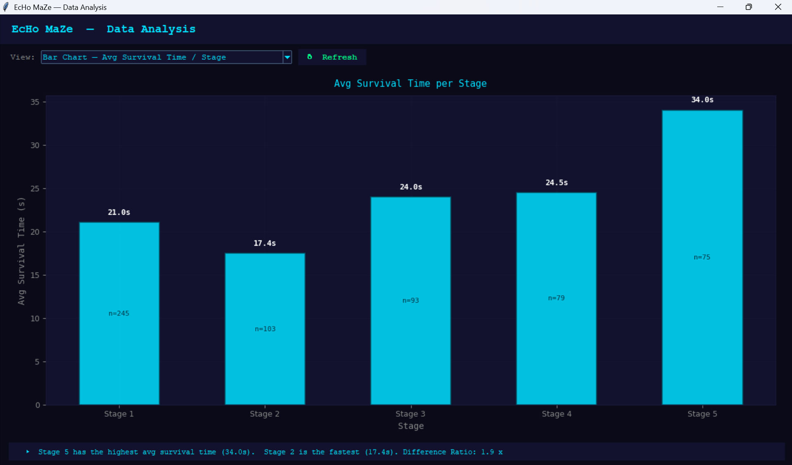
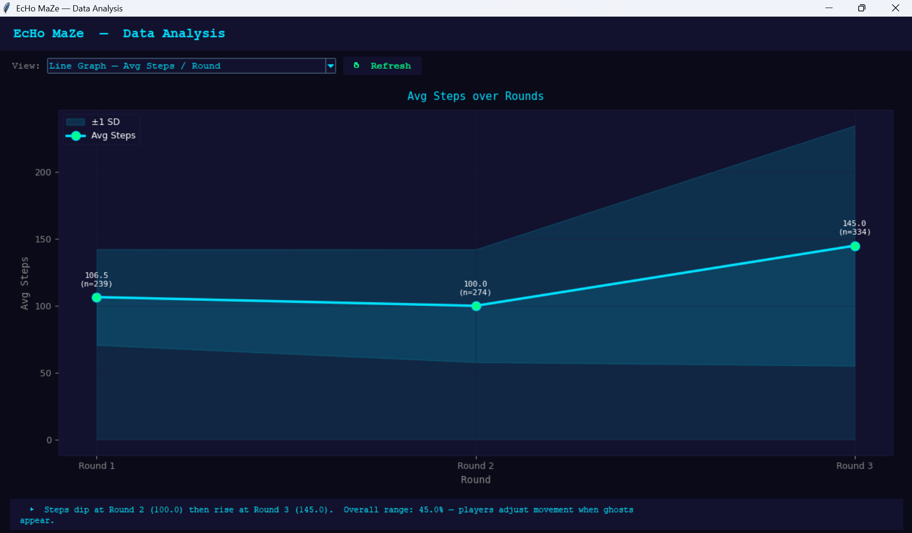
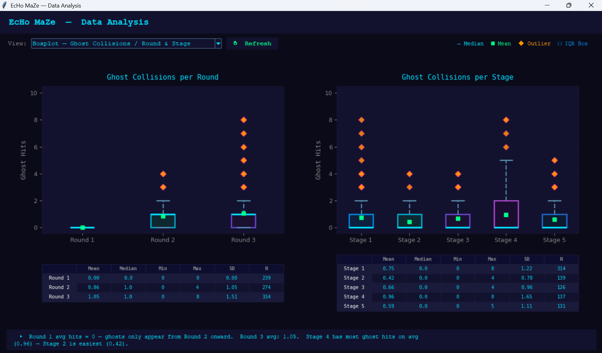
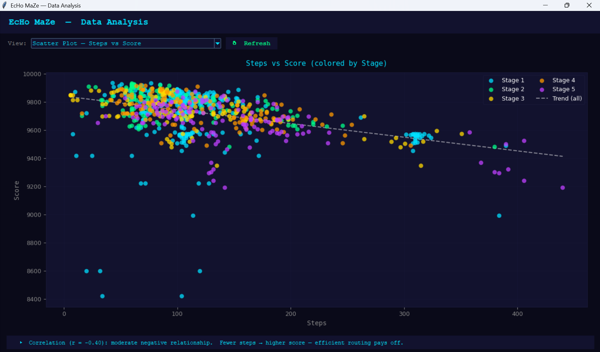
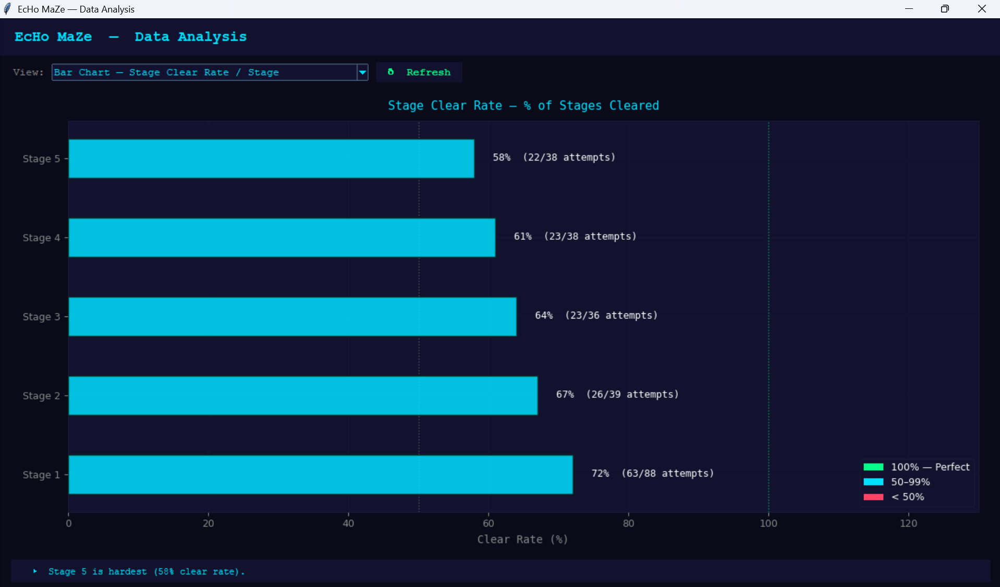

# EcHo MaZe — Data Visualization

This document covers all data visualizations in the **EcHo MaZe — Data Analysis Report**, which can be opened from the main menu through **Stats → Data Analysis Report**. The data comes from 847 rounds played by 26 players across all 5 stages, saved in `data/game_data.csv`. Each chart also has a dynamic insight line at the bottom that automatically updates to summarize what the current data shows.

---

## Overview

The Data Analysis window is built with Tkinter and Matplotlib and runs alongside the game in a separate thread. Players can switch between six different views using the dropdown menu, and hit Refresh to load the latest data at any time without closing the window. A dynamic insight bar at the bottom of each view automatically computes and displays key findings from the current data.
---

## 1. Summary Statistics Table

The Summary Statistics Table gives a broad overview of five gameplay features — Survival Time (s), Steps, Items Collected, Ghost Collisions, and Score — across all 847 rounds from 26 players. For each feature, the table shows the Mean, Median, Min, Max, Standard Deviation, and total record count (N).

A few things stand out from the numbers. The mean survival time is 20.78 seconds but the median is only 17.62 seconds, which suggests the distribution is right-skewed — most players finish relatively quickly, but a few high-performing players survive much longer and pull the average up. Ghost Collisions have a mean of 0.69 but a median of 0.00, meaning most rounds end with no collision at all, and the average is driven up by a smaller group of rounds where players get hit multiple times. The Score distribution is quite tight (SD = 168.86), which makes sense since the scoring formula is simply `Score = 10,000 − (time × 10)` — the only variable is how long the player takes.

---

## 2. Bar Chart — Average Survival Time per Stage

This bar chart shows the average survival time of completed rounds for each stage, with the number of samples (n) shown inside each bar. The x-axis is the stage number and the y-axis is average time in seconds.

The pattern is mostly what you would expect — later stages take longer — but Stage 2 (17.4s) is actually faster than Stage 1 (21.0s). This is likely because players who make it to Stage 2 already understand how the game works, so they move through the maze more efficiently. From Stage 3 onward the times increase steadily: Stage 3 (24.0s), Stage 4 (24.5s), and Stage 5 (34.0s), reflecting the more complex and tighter maze layouts in later stages. The gap between the fastest and slowest stage is about 1.9×, which shows the difficulty curve is meaningful but not extreme.

---

## 3. Line Graph — Average Steps per Round

This line graph shows how the average number of steps changes across the three rounds in each stage. The shaded area is ±1 standard deviation, showing how spread out player behavior is. Sample sizes are annotated at each point.

The most interesting thing here is the dip in Round 2 (100.0 steps) compared to Round 1 (106.5 steps), followed by a big jump in Round 3 (145.0 steps). The dip makes sense — after exploring the maze in Round 1, players have a better idea of the layout and move more directly in Round 2. But in Round 3, two ghosts are active at the same time, both replaying earlier paths, which forces players to take longer detours to avoid them. The 45% increase from Round 2 to Round 3 is a direct reflection of how much the Echo System mechanic changes how players have to move.

---

## 4. Boxplot — Ghost Collisions per Round & Stage

This view shows two boxplots side by side — ghost collisions per round on the left, and per stage on the right. Each box shows the interquartile range, with the cyan line as the median, the green square as the mean, and orange diamonds as outliers. Stats tables are shown below each plot for easy reference.

On the per-round side, Round 1 has zero collisions by design since there are no ghosts yet. Round 2 (mean = 0.86, SD = 1.05) and Round 3 (mean = 1.05, SD = 1.51) both show increasing collision rates as more ghosts are added. The growing standard deviations reflect how player outcomes start to diverge more — some players dodge ghosts effectively while others get caught repeatedly, which shows up as the long upper tails and outliers in the plots.

On the per-stage side, Stage 4 has the highest average collision rate (0.96), which is likely linked to its breakable wall mechanic — walls that change the maze structure mid-round make ghost paths less predictable. Stage 2 has the lowest (0.42), again consistent with the learning effect seen in earlier charts. The outliers reaching up to 8 collisions suggest there are rounds where things go significantly wrong for some players, whether due to ghost path convergence or poor route planning.

---

## 5. Scatter Plot — Steps vs Score

This scatter plot looks at the relationship between how many steps a player takes and their final score, with points colored by stage. A trend line is fitted across all data to show the overall direction.

The correlation is r = −0.40, a moderate negative relationship — players who take fewer steps tend to score higher. This follows logically from the scoring formula since fewer steps usually means faster completion and less time penalty. The cluster of points in the upper-left (few steps, high scores) represents efficient play, while points trailing toward the lower-right show rounds where players had to take long detours, likely due to ghost avoidance. Looking at the colors, Stage 1 and 2 points tend to cluster at lower step counts, while Stage 4 and 5 points spread further right, which aligns with those stages having more complex routes.

---

## 6. Bar Chart — Stage Clear Rate per Stage

This horizontal bar chart shows what percentage of players successfully cleared each stage, calculated as stage clears divided by first-round attempts. Bars are colored green for 100%, cyan for 50–99%, and red for below 50%, with reference lines at 50% and 100%.

The clear rate decreases from Stage 1 (72%, 63/88 attempts) down to Stage 5 (58%, 22/38 attempts), which matches the intended difficulty progression. Stage 2 (67%) is slightly lower than Stage 1 even though players complete it faster on average, suggesting the maze layout introduces routing challenges that cause some players to fail despite being quick. Stages 3 through 5 decline gradually, with Stage 5 being the hardest at 58%. No stage falls below 50%, which suggests the game is challenging but remains completable for most players who attempt it.
